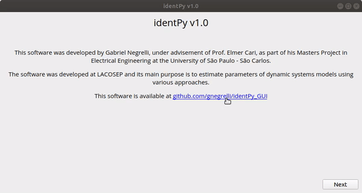
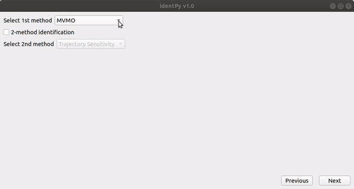
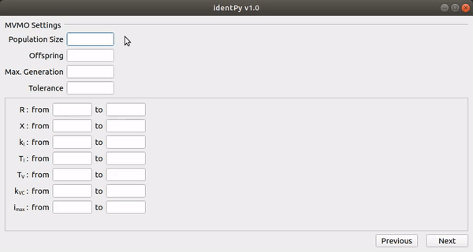
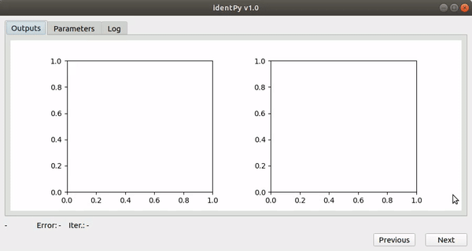

# identPy_GUI

This repository contains the GUI application developed for **[identPy](https://github.com/gnegrelli/identPy)**, a 
framework for parameter estimation of nonlinear dynamic systems. This application was created using PySide2.

## Installation

Install the GUI requirements by executing the following command on the terminal:

```bash
$ pip install -r requirements.txt
```

## Usage

To start the GUI application, simply run the script `main.py` located on the root directory of this repository.

The initial page will be displayed with some information about the software.



Next, a page for model selection is shown. In this page, the user will indicate which model will be estimated. When the 
model is selected, a short text with information about the model selected is displayed. The user must also indicate the 
location of file containing the measurements and which columns of the data correspond to the inputs and outputs, as 
well as the initial conditions of states.


On the next page, the user will be able to select the estimation methods that will be applied. By clicking on the select 
box, the user enables the estimation in two steps, where the solution found by the first method is used as starting 
point by the second method in order to refine it.



The configuration of the chosen methods is done on the subsequent views. Each method has its own custom configuration 
page based on a template (MVMO's page is presented below). On the upper half of the page, the user must set general 
configurations for the method, i.e. population size and tolerance, while on the bottom portion, settings specific to the 
model chosen are defined.



With all set, the estimation process can start. The next page shows the current results of the estimation in three tabs. 
The first one contains graphs depicting the outputs from the real system and the current solution. The "Parameters" tab 
presents the current value of the parameters estimated by the software. A log with information of how the estimation 
process evolved is displayed in the last tab.



## Contributing

Users are welcome to contribute to identPy with new methods, models and pages.

### Page design

It is recommended to use Qt5 Designer tool in order to create new pages and modify existing ones. It can be installed 
by executing the following command:

```bash
$ sudo apt install qttools5-dev-tools
```

In order to convert the ui files generated by Qt5 Designer into python code, use the following command on terminal:

```bash
$ pyside2-uic ui_file.ui -o python_file.py
```
